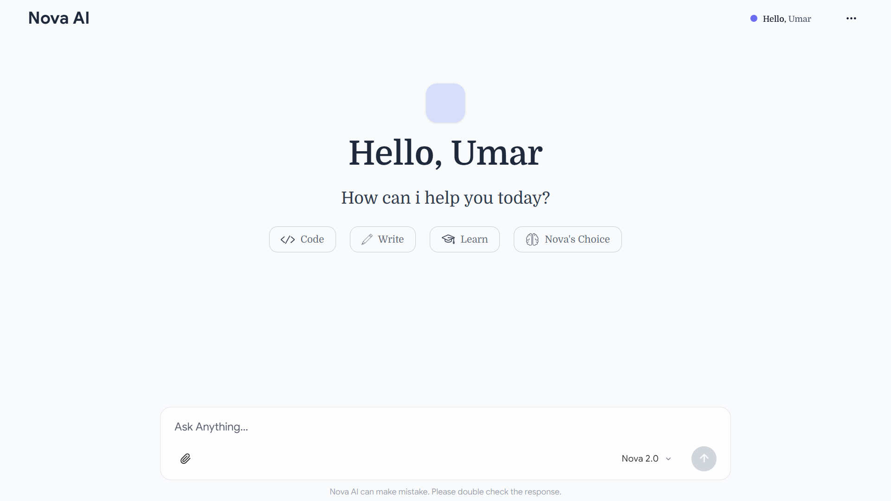
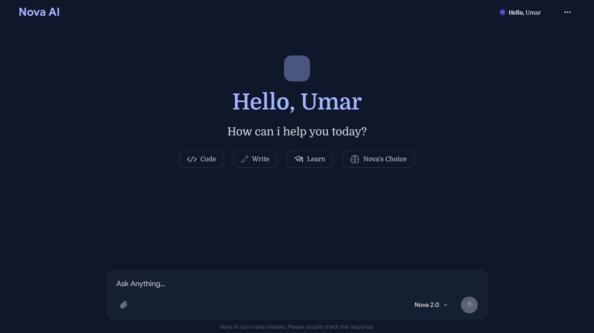
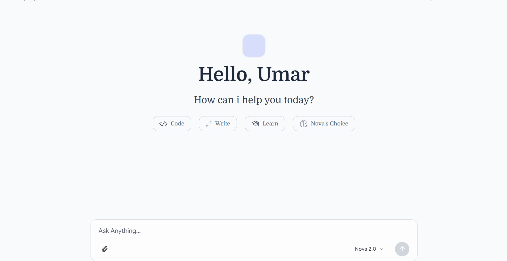

# Nova AI

A full-stack AI chat application built on a custom PHP framework, powered by Google's Gemini API. No Laravel, no Symfony. The routing, database layer, HTTP client, and session handling are all written from scratch.

## Why I built this

I wanted to understand what frameworks like Laravel actually do under the hood instead of just using them. So before writing a single line of chat logic, I built the pieces a framework normally hands you: a router that resolves controller methods through reflection, a query builder for MySQL, an HTTP client wrapper for making streaming requests to external APIs, and session handling. Nova AI is what I built on top of that foundation.

## Screenshots

<p align="center">
  
</p>

<p align="center">
  
</p>

<p align="center">
  
</p>

## Features

- Real-time streaming responses using Server-Sent Events, so replies appear as they're generated instead of waiting for the full response
- Three model presets (Nova 2.0, Nova Pro, Nova Writes), each tuned with different temperature and sampling settings depending on whether you want quick answers or more deliberate ones
- An "extended thinking" toggle that adjusts generation parameters for more thorough responses
- File and image uploads, sent directly to Gemini as part of the conversation
- Markdown rendering with syntax-highlighted code blocks
- Persistent chat history stored in MySQL
- Light and dark themes
- Personalization — the app remembers your name and how you'd like to be addressed

## Tech stack

**Backend:** PHP 8.2+, MySQL, [BuildQL](https://github.com/BuildQL/query-builder) for database queries, Gemini API

**Frontend:** Vanilla JavaScript (ES modules), Tailwind CSS v4, marked.js + highlight.js for markdown rendering, DOMPurify for output sanitization

## How streaming works

Gemini's streaming endpoint doesn't return clean, line-by-line JSON — it sends one large JSON array a piece at a time, and that array isn't valid JSON until the very last chunk arrives. Waiting for the whole thing would defeat the point of streaming.

Instead, the backend reads the incoming bytes character by character and tracks brace depth to detect when a single JSON object inside that array is complete, even while the array as a whole is still open. As soon as one object closes, its text gets extracted and pushed to the browser immediately. The frontend then re-renders the accumulated markdown on each update, throttled so it doesn't repaint the DOM more often than the browser can actually redraw.

## Project structure

```
app/
  Controller/       Route handlers
  Core/             Router, RouteDispatcher, HTTP client, Session
  Support/          Shared helper classes
config/             App configuration
public/
  css/              Compiled Tailwind output
  js/                Frontend modules (API client, UI rendering, DOM helpers)
  uploads/          User-uploaded files
routes/             Route definitions
```

## Setup

1. Clone the repo and point your local server (Apache/XAMPP, etc.) at the project's root directory
2. Copy `.env.example` to `.env` and fill in your database credentials and Gemini API key.
3. Import the database schema from `database/schema.sql`.
4. Install frontend dependencies and build the CSS:
   ```
   npm install
   npx @tailwindcss/cli -i ./public/css/input.css -o ./public/css/output.css --watch
   ```
5. Visit the app in your browser.

## Environment variables

```
DB_HOST=
DB_NAME=
DB_USER=
DB_PASS=
DB_TABLE=
GEMINI_API_KEY=
```

## Notes

This is a personal project built for learning, not a production-hardened product. If you spot something that could be done better, issues and pull requests are welcome.

## License

MIT